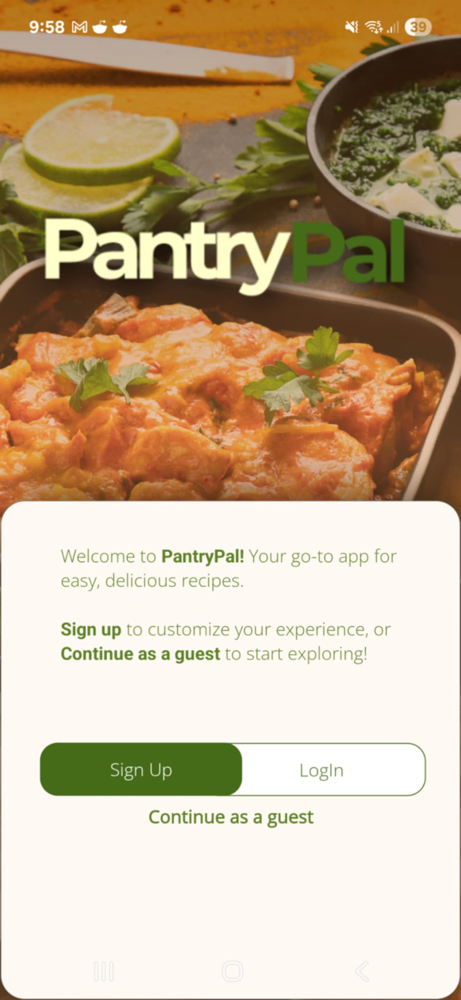

# Recipe App

A cross-platform mobile application built with .NET MAUI that helps users discover, save, and manage recipes.



## Features

- **User Authentication**
  - Login and Sign Up functionality
  - Google Authentication support
  - User profile management

- **Recipe Management**
  - Browse and explore recipes
  - View detailed recipe information
  - Save favorite recipes
  - Filter and search capabilities

- **Categories and Meals**
  - Organized recipe categories
  - Meal type classification
  - Easy navigation through different food types

## Technical Stack

- **Framework**: .NET MAUI 9.0
- **Architecture**: MVVM (Model-View-ViewModel)
- **Key Dependencies**:
  - CommunityToolkit.Mvvm (8.4.0)
  - CommunityToolkit.Maui (11.2.0)
  - Newtonsoft.Json (13.0.3)
  - Firebase Authentication (for Android)

## Project Structure

```
RecipeApp/
├── Pages/                 # UI Pages
│   ├── HomePage          # Main landing page
│   ├── ExplorePage       # Recipe discovery
│   ├── FavoritesPage     # Saved recipes
│   ├── ProfilePage       # User profile
│   ├── LoginPage         # Authentication
│   └── SignUpPage        # User registration
├── Models/               # Data models
│   ├── Recipe           # Recipe information
│   ├── Category         # Recipe categories
│   ├── Meal            # Meal types
│   └── FavoriteRecipe   # Saved recipes
├── ViewModels/          # View models for MVVM
├── Services/            # Business logic and services
├── Resources/           # App resources
│   ├── Images          # App images and icons
│   ├── Fonts           # Custom fonts
│   └── Raw             # Other resources
└── Platforms/          # Platform-specific code
```

## Supported Platforms

- Android (API 21+)
- iOS (15.0+)
- macOS (15.0+)
- Windows (10.0.17763.0+)

## Getting Started

1. Clone the repository
2. Install .NET 9.0 SDK
3. Install Visual Studio 2022 with .NET MAUI workload
4. Open the solution in Visual Studio
5. Restore NuGet packages
6. Build and run the application

## Development

The application follows the MVVM pattern and uses the CommunityToolkit.Mvvm package for simplified MVVM implementation. The UI is built using XAML and follows modern design principles.

## Dependencies

- Microsoft.Maui.Controls (9.0.60)
- Microsoft.Maui.Graphics (9.0.60)
- CommunityToolkit.Mvvm (8.4.0)
- CommunityToolkit.Maui (11.2.0)
- Newtonsoft.Json (13.0.3)
- Firebase Authentication (Android only)

## Current Status and Limitations

### Working Features

#### Recipe Management
- Basic recipe browsing and exploration using TheMealDB API
- View detailed recipe information
- Search functionality for recipes
- Random meal generation
- Category and area-based filtering
- First letter search functionality

#### User Authentication
- Email/password signup and login
- Password reset functionality
- Email verification
- Account deletion
- Session persistence
- Basic profile management

#### Favorites System
- Add/remove recipes to favorites
- View favorite recipes
- Favorites persistence using Firestore

### API Limitations

#### TheMealDB API
- Limited filtering capabilities - can only filter by one category or area at a time
- No pagination support
- No advanced search filters (e.g., ingredients, cooking time, difficulty)
- Rate limiting may apply for free tier
- Limited recipe metadata (no nutritional information, cooking time, difficulty level)

#### Firebase Authentication
- Google Authentication is implemented but not working
- Limited to basic email/password authentication
- No social media integration besides Google (which isn't working)

#### Firestore Database
- Basic CRUD operations for favorites
- Limited query capabilities
- No real-time updates
- No offline support
- Limited data types support (mainly strings and timestamps)

### Technical Constraints

#### Platform Support
- Cross-platform support for Android, iOS, macOS, and Windows
- Minimum version requirements:
  - Android: API 21+
  - iOS: 15.0+
  - macOS: 15.0+
  - Windows: 10.0.17763.0+

#### Architecture
- MVVM pattern implementation
- Basic navigation service
- Limited dependency injection
- No proper error handling strategy
- No proper logging system

#### Performance Considerations
- No image caching
- No offline data persistence
- No pagination for large data sets
- No proper loading states

### Missing Features

#### Recipe Management
- No user-created recipes
- No recipe sharing
- No recipe comments or ratings
- No meal planning
- No shopping list generation

#### User Experience
- No dark mode support
- No proper error messages
- No loading indicators
- No proper form validation
- No proper image handling

#### Social Features
- No user profiles
- No social sharing
- No community features
- No recipe recommendations

#### Security Considerations

#### API Keys
- Firebase API keys are exposed in the code
- No proper key management
- No environment-specific configurations

#### Authentication
- Basic security measures
- No proper token refresh mechanism
- No proper session management

### Planned Improvements

#### API Integration
- Implement proper error handling
- Add request caching
- Implement proper loading states
- Add pagination support
- Consider using a different recipe API with more features

#### Authentication
- Fix Google Authentication
- Add proper token refresh
- Implement proper session management
- Add more social login options

#### Data Management
- Implement proper offline support
- Add proper caching
- Implement real-time updates
- Add proper data validation

#### User Experience
- Add proper loading indicators
- Implement proper error messages
- Add proper form validation
- Implement dark mode
- Add proper image handling

#### Security
- Move API keys to secure configuration
- Implement proper key management
- Add environment-specific configurations
- Implement proper security measures

## License

[Add your license information here] 